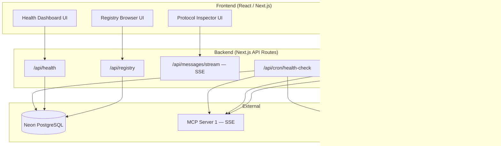

# MCPHub — Feature Documentation

> **"Postman for MCP"** — A web-based developer tool to discover, test, debug, and monitor MCP (Model Context Protocol) servers.

MCPHub is the first unified platform that combines **server discovery** (public registry), **interactive testing** (tool playground), **protocol debugging** (JSON-RPC inspector), **performance monitoring** (health dashboard), and **CI/CD automation** (CLI tool) for the MCP ecosystem. It eliminates the fragmented workflow developers face today — bouncing between static GitHub lists, local CLI inspectors, and manual `curl` commands — and replaces it with a single, shareable, web-based experience.

---

## Tech Stack

| Layer | Technology | Why |
|-------|-----------|-----|
| **Framework** | Next.js 14+ (App Router) | Full-stack: React frontend + API routes for MCP client logic. SSR for registry pages (SEO). Native Vercel deployment. |
| **Database** | Neon (Serverless PostgreSQL) | Scales to zero, Vercel-native integration, perfect for registry data + metrics storage. |
| **ORM** | Drizzle ORM | Lightweight, type-safe, excellent Neon/PostgreSQL support. |
| **MCP Client** | `@modelcontextprotocol/sdk` | Official Anthropic SDK — handles protocol handshake, JSON-RPC framing, SSE transport. |
| **Styling** | Tailwind CSS + shadcn/ui | Rapid UI development, accessible component primitives, consistent design system. |
| **State** | Zustand | Minimal client-side state management for connection & inspector state. |
| **Charts** | Recharts | React-native charting for the health dashboard. |
| **Validation** | Zod | Runtime type validation for API inputs, pairs naturally with TypeScript. |
| **CLI** | Commander.js + picocolors | Standard Node.js CLI tooling, lightweight, colorized terminal output. |
| **Deployment** | Vercel | Native Next.js hosting, serverless functions, cron jobs, edge network. |

---

## Architecture Overview



**Key architectural constraint:** The frontend cannot connect directly to arbitrary MCP servers (CORS, security). All MCP communication is proxied through Next.js API routes. The backend maintains MCP client connections and streams protocol messages back to the frontend via its own SSE endpoints.

---

## MVP Scope (~45 Hours)

### Included

| # | Feature | Doc | Est. Hours |
|---|---------|-----|------------|
| 1 | Server Connection Manager | [01-server-connection-manager.md](01-server-connection-manager.md) | ~8h |
| 2 | Interactive Tool Playground | [02-interactive-tool-playground.md](02-interactive-tool-playground.md) | ~10h |
| 3 | Protocol Inspector | [03-protocol-inspector.md](03-protocol-inspector.md) | ~7h |
| 4 | Server Health Dashboard | [04-server-health-dashboard.md](04-server-health-dashboard.md) | ~6h |
| 5 | Public Registry | [05-public-registry.md](05-public-registry.md) | ~8h |
| 6 | CLI Tool (`npx mcphub test`) | [06-cli-tool.md](06-cli-tool.md) | ~6h |

### Cut from MVP

- **No server hosting** — MCPHub tests servers, it doesn't run them
- **No authentication for browsing** — Registry and playground are publicly accessible
- **No rating/review system** — Health metrics serve as an objective quality signal instead
- **No stdio proxy** — MVP focuses on SSE/HTTP transport; stdio servers require a separate bridge
- **No real-time collaboration** — Single-user sessions only

---

## Rationale & Alternatives

See [WHY_MCPHUB.md](WHY_MCPHUB.md) for a detailed analysis of:
- What MCP is and why it matters
- Existing alternatives (MCP Inspector, Smithery.ai, Glama.ai, awesome-mcp-servers, Postman)
- Six specific market gaps MCPHub fills
- Strategic positioning in the MCP ecosystem

---

## Project Structure (Next.js)

```
mcphub/
├── app/                          # Next.js App Router
│   ├── layout.tsx                # Root layout
│   ├── page.tsx                  # Landing page
│   ├── globals.css
│   ├── playground/
│   │   ├── page.tsx              # Main playground
│   │   └── [serverId]/page.tsx   # Playground for registry server
│   ├── registry/
│   │   ├── page.tsx              # Browse/search servers
│   │   ├── submit/page.tsx       # Submit new server
│   │   └── [serverId]/page.tsx   # Server detail page
│   ├── inspector/page.tsx        # Protocol inspector
│   ├── dashboard/page.tsx        # Health dashboard
│   └── api/                      # Route Handlers
│       ├── connect/route.ts
│       ├── disconnect/route.ts
│       ├── tools/{list,call}/route.ts
│       ├── resources/{list,read}/route.ts
│       ├── prompts/{list,get}/route.ts
│       ├── messages/stream/route.ts
│       ├── health/route.ts
│       ├── registry/route.ts
│       └── cron/health-check/route.ts
│
├── lib/                          # Server-side logic
│   ├── mcp/                      # MCP client, connection manager, protocol logger
│   ├── db/                       # Neon client, schema, migrations
│   ├── validators/               # Zod schemas
│   └── utils/                    # JSON-RPC helpers, error classes
│
├── components/                   # React components
│   ├── ui/                       # shadcn/ui base components
│   ├── connection/               # Connect form, status indicator, capabilities view
│   ├── playground/               # Tool selector, param form, response viewer
│   ├── inspector/                # Message list, detail view, filters
│   ├── dashboard/                # Metric cards, charts, tables
│   ├── registry/                 # Server cards, search, submit form
│   └── shared/                   # JSON viewer, code blocks, loading states
│
├── hooks/                        # Custom React hooks
├── stores/                       # Zustand stores
├── cli/                          # CLI package (separate package.json)
│   ├── bin/mcphub.ts
│   ├── commands/                 # test, inspect, registry
│   └── reporters/                # terminal, json
│
├── drizzle.config.ts
├── tailwind.config.ts
├── next.config.ts
├── package.json
├── vercel.json
└── README.md
```

---

## Document Index

| Document | Description |
|----------|-------------|
| [WHY_MCPHUB.md](WHY_MCPHUB.md) | Market analysis, competitor comparison, rationale |
| [01-server-connection-manager.md](01-server-connection-manager.md) | Connect to MCP servers, display capabilities |
| [02-interactive-tool-playground.md](02-interactive-tool-playground.md) | Auto-generated forms, tool execution, response viewing |
| [03-protocol-inspector.md](03-protocol-inspector.md) | Raw JSON-RPC message viewer with timing |
| [04-server-health-dashboard.md](04-server-health-dashboard.md) | Latency, error rates, response size metrics |
| [05-public-registry.md](05-public-registry.md) | Searchable MCP server directory with health data |
| [06-cli-tool.md](06-cli-tool.md) | `npx mcphub test <server>` for automated checks |
